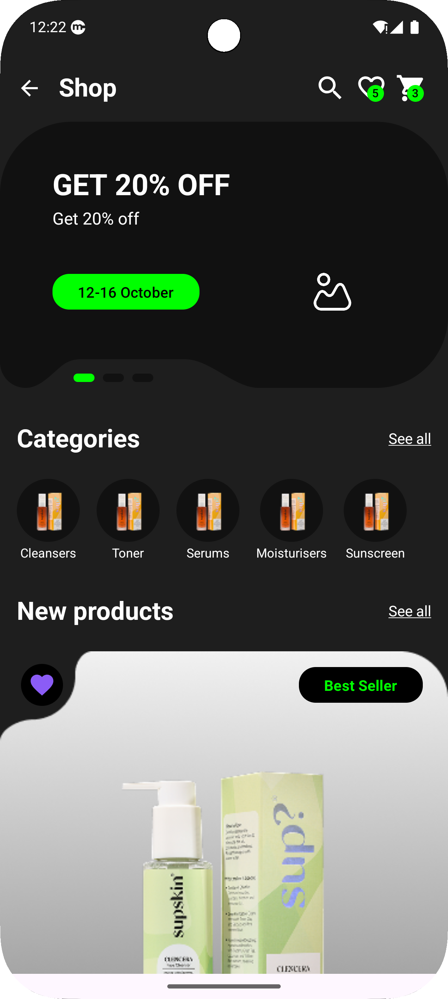
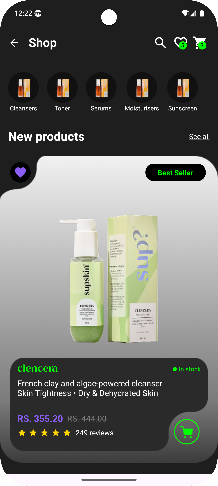
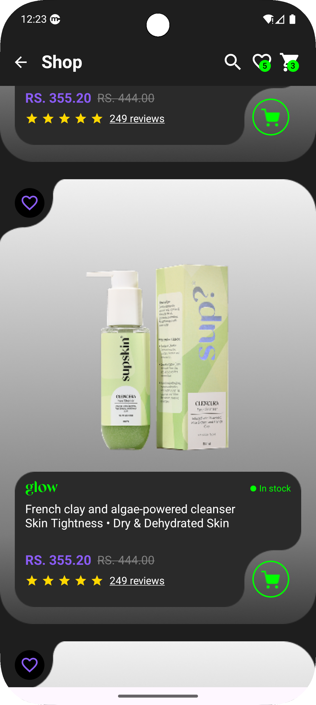
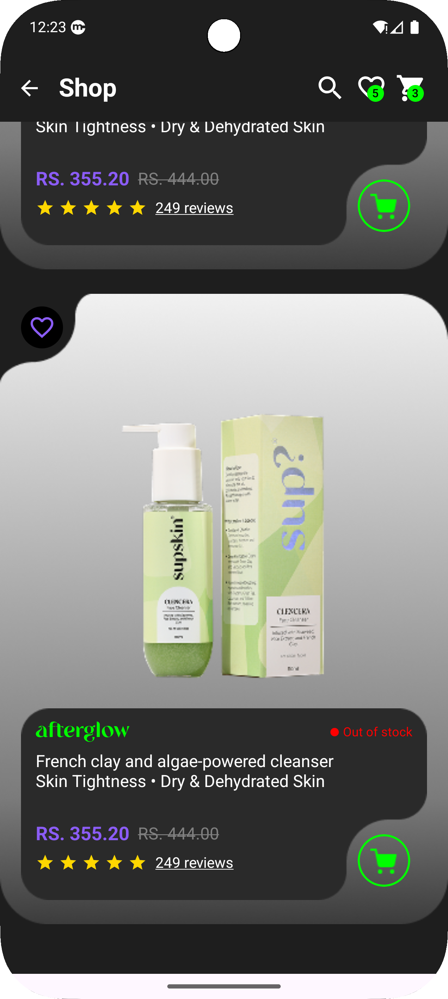

# Skincare App - Jetpack Compose UI Practice 🧴

The **Skincare App** is a practice Android application built to showcase the power of **Jetpack Compose** for crafting modern, responsive, and visually appealing user interfaces. This app simulates a skincare product shopping experience, focusing on UI design with a sleek, dark-themed layout and Material 3 components.

---

## Table of Contents
- [Overview](#overview) ℹ️
- [UI Features](#ui-features) 🎨
- [Screenshots](#screenshots) 📸
- [Setup](#setup) ⚙️
- [Technologies Used](#technologies-used) 🛠️
- [Learning Objectives](#learning-objectives) 📚
- [Contributing](#contributing) 🤝
- [License](#license) 📜

---

## Overview ℹ️
This project is a hands-on exploration of Jetpack Compose, designed to practice building a skincare product shopping app UI. It features a top app bar, discount banner, category carousel, and product cards, all created with Compose's declarative approach for a seamless and engaging user experience.

---

## UI Features 🎨
- **Top App Bar** 🧭: Includes navigation (back button), search, and badged icons for favorites ❤️ and cart 🛒.
- **Discount Banner** 🎉: Promotes offers (e.g., "GET 20% OFF") with a call-to-action button and carousel indicators.
- **Category Carousel** 📜: A horizontal `LazyRow` displaying skincare categories like Cleansers and Serums.
- **Product Cards** 🛍️: A vertical `LazyColumn` of products with name, description, pricing (strikethrough for original price), stock status, and best-seller badges 🏆.
- **Interactive Elements** 🖱️: Favorite toggles, add-to-cart buttons, and underlined "See all" links.
- **Custom Styling** ✨: Uses the `Tangerine` font and a dark theme with vibrant accents (green, purple).

---

## 📸 App Screenshots

<div align="center">
   
  
  
  
</div>

---

## Setup ⚙️

To run this UI practice app locally:

1. **Clone the Repository** 📥:
   ```bash
   git clone https://github.com/yourusername/skincare-app.git
   ```

2. **Open in Android Studio** 🖥️:
    - Select `File > Open` and choose the cloned repository folder.

3. **Sync Gradle** 🔄:
    - Click `Sync Project with Gradle Files` to download dependencies.

4. **Add Resources** 🖼️:
    - Place drawable resources (`shop_flow_card`, `image_view`, `categorysample`, `card_grey_bg`, `card_black_shape`, `cart3`, `product_image`) in `res/drawable`.
    - Add the `tangerine.ttf` font file to `res/font` for custom typography.
    - Optionally, replace placeholder `imageUrl` in the `products` list with drawables or use an image loading library like Coil.

5. **Run the App** 🚀:
    - Connect an Android device or start an emulator.
    - Click `Run > Run 'app'` in Android Studio.

---

## Technologies Used 🛠️
- **Jetpack Compose** 🖌️: Declarative UI development.
- **Material 3** 🎨: Modern design components.
- **Kotlin** 💻: Primary programming language.
- **LazyColumn & LazyRow** 📜: Efficient scrolling lists.
- **Custom Fonts** ✍️: `Tangerine` for product names.
- **Android SDK** 📱: Android-specific functionality.

---

## Learning Objectives 📚
This project aims to practice:
- Building complex layouts with `Scaffold`, `LazyColumn`, and `LazyRow` 🏗️.
- Using Material 3 components like `TopAppBar`, `Badge`, and `Button` 🧩.
- Creating custom UI with gradients, shapes, and fonts 🎨.
- Managing interactivity in Compose (e.g., clickable icons) 🖱️.
- Structuring clean, reusable UI code 🧹.

---

## Contributing 🤝
This is a practice project, but feedback is welcome! To contribute:
1. Fork the repository 🍴.
2. Create a feature branch (`git checkout -b feature/your-feature`) 🌿.
3. Commit changes (`git commit -m "Add your feature"`) 💾.
4. Push to the branch (`git push origin feature/your-feature`) 🚀.
5. Open a pull request 📬.

---

## License 📜
This project is licensed under the MIT License. See the [LICENSE](LICENSE) file for details.